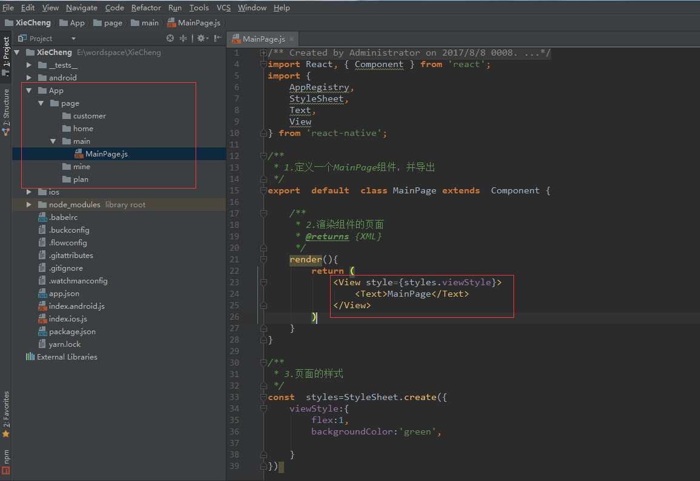
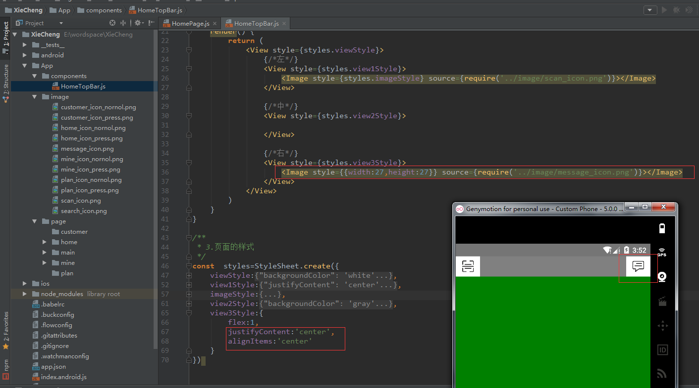

# ReactNative之携程APP(一)

## 1.新建XieCheng项目

在window的控制台执行下面命令（ 前提是已经搭建好reactnative的开发环境 ）：

```cmd
react-native init XieCheng  // XieCheng 是项目名称
```


## 2.打开新的项目

这里使用webStrom打开项目


## 3.运行项目

### 1.先在电脑上启动模拟器

下面使用5.0的模拟器


### 2.检查adb是否连接上模拟器

在使用adb前要配好android的开发环境变量


### 3.开始包服务

在控制台进入到项目的根目录执行：

```
react-native start 
```


### 4.运行XieCheng项目

```cmd
react-native run-android
```


执行后的效果：


## 4.搭建项目的框架

### 1.搭建项目结构

**每一个模块对应一个目录，分别存放各自组件**

新建一个**MainPage**组件作为应用的主页页面



### 2.设计主页面

**MainPage**作为主页面,修改**index.android.js** 和  **index.ios.js**文件 


执行效果：


## 5.搭建底部的导航栏

### 1.导入TabNavigator库

TabNavigator [Github地址](https://github.com/happypancake/react-native-tab-navigator) 


在控制台进入到项目的根目录下执行下面命令：

```
npm install react-native-tab-navigator --save
```

如果报错请执行多次


### 3.在MainPage中引入该组件


### 4.底部导航条添加Item

1.引入图片资源存放在image目录


2.添加TabNavigator.Item，导航栏对应的每一个Item


设置选中**renderSelectedIcon**以及默认**renderIcon**Item对应的样式以及对应图片


执行的效果：


### 5.默认选中首页

初始化state（状态机）中的 selected的值为‘首页’，通过**TabNavigator.Item**中的属性**selected** 进行判断，是否选中当前item。


### 6.底部的Item之间的切换

编写其它TabNavigator其它Item，同上。


完整**MainPage.js**的代码

```
/**
 * Created by Administrator on 2017/8/8 0008.
 */
import React, { Component } from 'react';
import {
    AppRegistry,
    StyleSheet,
    Text,
    View,
    Image
} from 'react-native';
//引入TabNavigator库
import  TabNavigator from 'react-native-tab-navigator';

/**
 * 1.定义一个MainPage组件，并导出
 */
export  default  class MainPage extends  Component {

    /**
     * 状态机
     * @type {{}}
     */
    state={
        selected:'首页'
    }


    /**
     * 2.渲染组件的页面
     * @returns {XML}
     */
    render(){
        return (
            <TabNavigator
                tabBarStyle={{backgroundColor:'#e1e1e1',height:50}}
            >
                {/*首页*/}
                <TabNavigator.Item
                    renderIcon={ ()=> <Image style={styles.imageStyle}
                                        source={require('../../image/home_icon_nornol.png')}></Image>}
                    title="首页"

                    selected={this.state.selected=='首页'}
                    renderSelectedIcon={ ()=> <Image style={styles.imageStyle}
                                        source={require('../../image/home_icon_press.png')}></Image>}

                    onPress={ ()=> this.setState({
                        selected:'首页'
                    }) }
                >
                    <Text>home</Text>
                </TabNavigator.Item>

                {/*行程*/}
                <TabNavigator.Item
                    renderIcon={ ()=> <Image style={styles.imageStyle}
                                        source={require('../../image/plan_icon_nornol.png')}></Image>}
                    title="行程"

                    selected={this.state.selected=='行程'}
                    renderSelectedIcon={ ()=> <Image style={styles.imageStyle}
                                        source={require('../../image/plan_icon_press.png')}></Image>}

                    onPress={ ()=> this.setState({
                        selected:'行程'
                    }) }

                >
                    <Text>plan</Text>

                </TabNavigator.Item>

                {/*客服*/}
                <TabNavigator.Item
                    renderIcon={ ()=> <Image style={styles.imageStyle}
                                        source={require('../../image/customer_icon_nornol.png')}></Image>}
                    title="客服"

                    selected={this.state.selected=='客服'}
                    renderSelectedIcon={ ()=> <Image style={styles.imageStyle}
                                        source={require('../../image/customer_icon_press.png')}></Image>}

                    onPress={ ()=> this.setState({
                        selected:'客服'
                    }) }
                >
                    <Text>customer</Text>
                </TabNavigator.Item>
                {/*我的*/}
                <TabNavigator.Item
                    renderIcon={ ()=> <Image style={styles.imageStyle}
                                        source={require('../../image/mine_icon_nornol.png')}></Image>}
                    title="我的"

                    selected={this.state.selected=='我的'}
                    renderSelectedIcon={ ()=> <Image style={styles.imageStyle}
                                        source={require('../../image/mine_icon_press.png')}></Image>}

                    onPress={ ()=> this.setState({
                        selected:'我的'
                    }) }
                >
                    <Text>mine</Text>

                </TabNavigator.Item>

            </TabNavigator>
        )
    }
}
/**
 * 3.页面的样式
 */
const  styles=StyleSheet.create({
    imageStyle:{
        width:24,
        height:24,
        marginTop:2,
    }
})
```

执行效果：


## 6.搭建首页的顶部导航栏

### 1.新建首页HomePage组件

点击首页Item时对应的页面。


### 2.引用首页HomePage组件

回到MainPage组件，在首页这个TabNavigator.Item中,用上面编写**HomePage**组件替代**Text**


执行效果：


### 3.新建一个HomeTopBar组件

编写首页页面顶部搜索框组件


### 4.引用HomeTopBar组件

在HomePage组件中引入HomeTopBar组件（顶部搜索框）


### 5.完善HomeTopBar布局

#### 1.通过权重布局

组件摆放位置


对应的样式：使用**flexDirection**规定组件摆放方向，使用**flex**属性定义每个组件的权重。


#### 2.左边布局

摆放**Image**组件，引入对应图片


#### 3.右边布局

也是摆放**Image**组件，引入对应图片



#### 4.中间布局

使用输入框**TextInput**组件和**Image**组件

1.修改背景：设置背景颜色，圆角矩形以及宽和高


2.添加输入框**TextInput**


对应的样式：设置间距，设置左间距30是等下为了摆放图片


3.添加搜索图标（**Image**）


对应的样式：通过设置绝对定位（**absolute**）的方式，定位图片摆放位置


