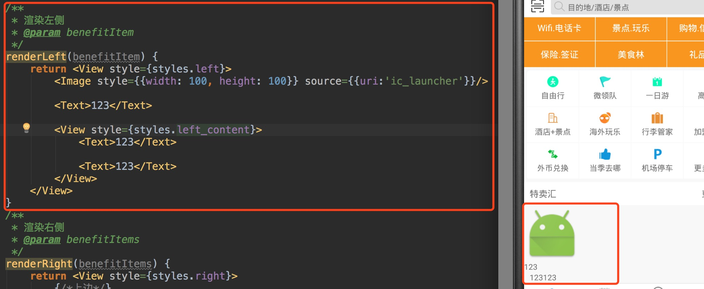

文章最后附上源码地址

上一片博客链接[RN开发实践——仿携程App（三）](http://blog.csdn.net/vroymond/article/details/77018897)

## 实现首页剩下的内容

要实现余下内容效果如下：


这里将分为三部分去写，也就是说我们这里将分成三个组件去写

第一个分类栏 如下：


第二个特卖专栏 如下：


第三个热门活动 如下：


## 编写分类栏组件

分类栏这里我把每一行都当成一个组件，总共三行，三行都是使用这个组件

### 准备数据
这里在homebean.json数据文件中准备了所有item的集合数据**cetegroys**


### 定义CategroyBar组件

创建CategroyBar的组件，这个组件就是每行的组件了。


### 使用CategroyBar组件

在HomePage遍历三次创建三个相同的CategroyBar组件


### 传递数据给CategroyBar组件

1.传递数据给CategroyBar组件

CategroyBar设置一个属性了categroys来接收每行对应的所有item数据


2.CategroyBar接收数据

在CategroyBar通过**this.props.categroys**来获取接受到的categroys数据

```JavaScript
// 接收数据
var categroyItems = this.props.categroys;
```


### 实现CategroyBar组件布局

1.布局搭建
接收完数据，开始CategroyBar布局搭建，这里拆分下结构，如图：


这里分为四个View，每个View分为上下结构，并且各自权重为1。因为每个View里面布局相同，使用for循环遍历创建


2.设置每个View的样式，权重为1，上下结构，内容居中，设置边框。


3.填充每个View的数据，完善CategroyBar组件。


## 编写特卖专栏组件

### 准备数据
这里在homebean.json数据文件中准备叫**benefit**的的数据。


### 定义SaleBar组件

简单创建SaleBar组件，等会将在这一步一步实现布局。


### 使用SaleBar组件
在HomePage中使用SaleBar组件


### 传递数据给SaleBar组件

1.在SaleBar设置一个属性了benefit来接收数据


2.在SaleBar组件接收数据

在SaleBar通过**this.props. benefit**来获取接受到的benefit数据


###实现SaleBar组件布局

这个组件 我做了这样拆分，如图：


先整体分为上下结构（红色框）,下面红色框分为左右结构（蓝色框），右边蓝色框分为上下结构（黄色框），在下边黄色框内再分为左右结构。这里稍微有点绕，但是一步一步来，就可以实现了。


####实现上面部分（标题部分）

这里上面部分，我定义成一个组件**TitleBar**方便后面使用


在SaleBar中使用


####实现下面部分

1.左侧布局实现，划分结构如图：


分为四个组件，最后两个组件在同一排，可以外层再裹上一层View组件。



2.填充数据，设置对应样式


3.右侧布局实现，划分结构如图


先分为上下结构，上边由三个组件构成，下边分为左右结构，左右两边布局相同。


4.填充数据，设置对应样式


##编写热门活动组件

终于到了首页最后一个组件了，这个组件稍微简单，都是由图片组成。

###准备数据

homebean.json数据文件中准备叫**hotPalys**的的数据。


###定义HotContentBar组件，并在HomePage中使用

步骤与前面两个组件一致，就不再赘述。

###传递数据

这里步骤与前面两个一致，就不再赘述。

####实现HotContentBar组件布局


1.划分结构
这里我这样划分，先分为上中下结构两层，上层是标题布局，已创建过TitleBar组件，可以重复使用。中间和下面内容部分都是图片组成。


2.填充数据，设置对应样式


最终效果如下：


最后附上[项目地址](https://github.com/CTSN/XieCheng)